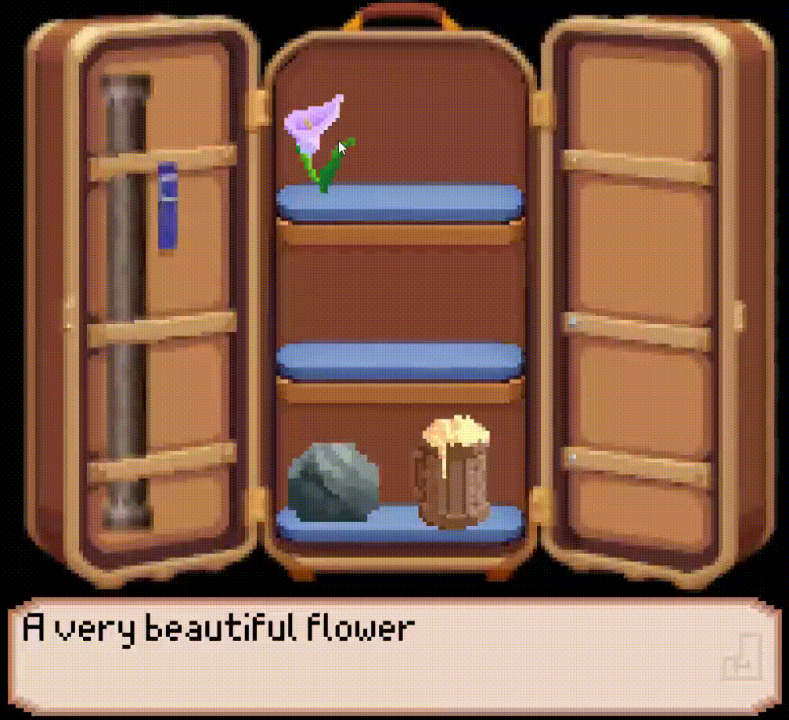
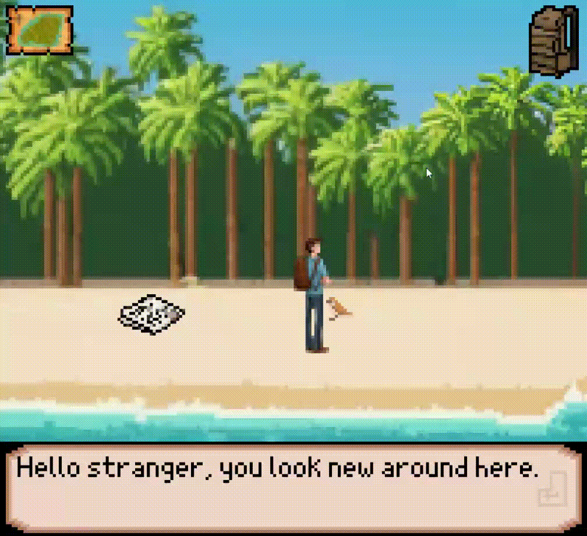
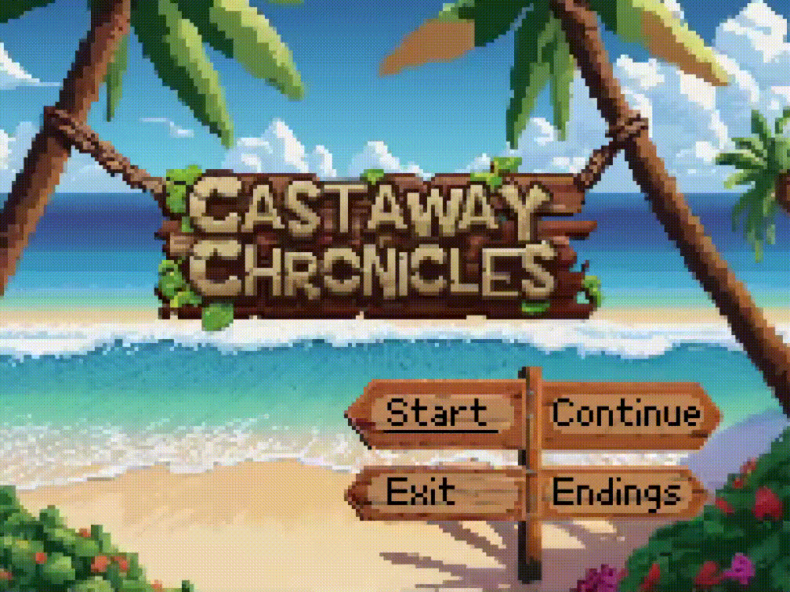
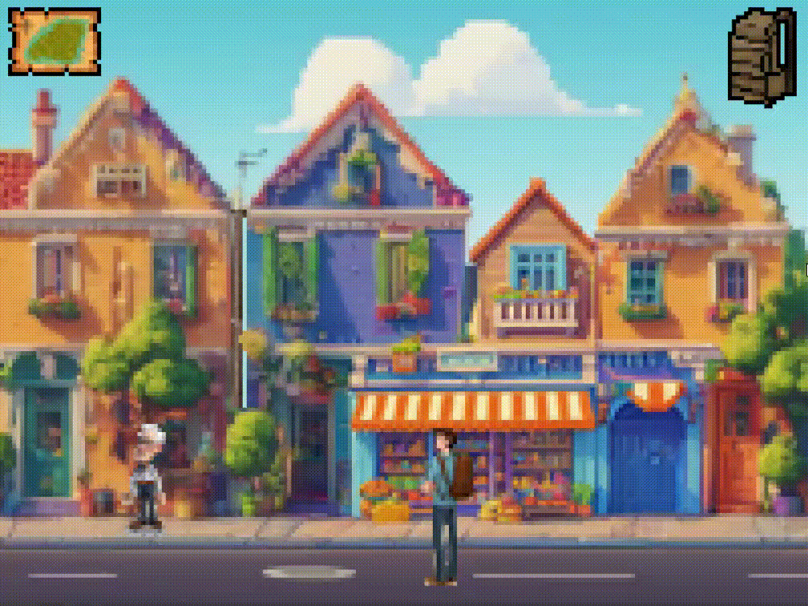
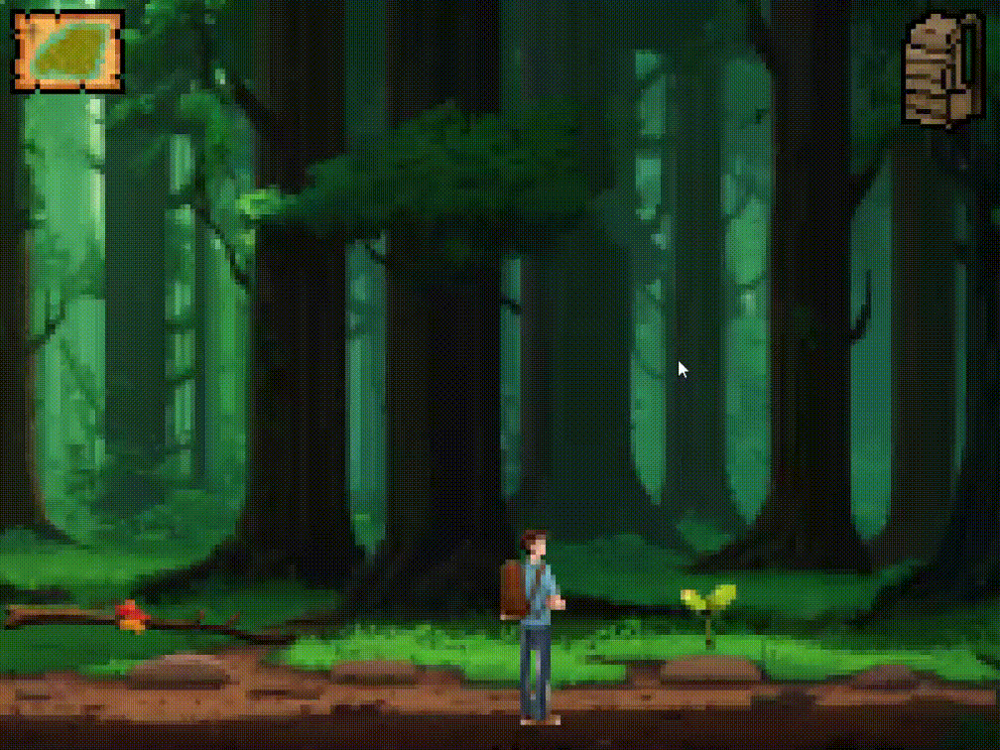

## LDTS_project-l01gr03 - CASTAWAY CHRONICLES

**Our project**: 

In this exciting game you arrive at an isolated island after a ship wreck and you receive unsettling news, what are you going to do?

This project was developed by *Bruno Aguiar* (*up202205619*@fe.up.pt), *Francisco Fernandes* (*up202208485*@fe.up.pt) and *Lara Coelho* (*up202208689*@fe.up.pt) for LDTS 2023⁄24.

### 🏁 HOW TO PLAY 

Controls in Menus
- `UP` Move to option above
- `DOWN` Move to option down
- `LEFT` Move to option left
- `RIGHT` Move to option right
- `ENTER` Select current option

Controls in Scenes
- `CLICK` Walk and select an object 

Controls with Text box
- `ENTER` Next speech

Controls in Text box with choice
- `UP` Move to option above
- `DOWN` Move to option down
- `ENTER` Select current choice

### ☑ IMPLEMENTED FEATURES

 Walking main character.

 Map with clickable icons for different locations.

 Backpack with the items the player picked up.

 Interactable elements.

 Pickable items.

 Choice making in dialogs and backpack items.

 Different endings and depending on user choices. 🚩spoiler alert

 Text Display.

 Main menu.

 Page with achieved endings. 🚩spoiler alert

 Save and continue game.

 Pause menu.

### SELF-EVALUATION

**Division of work**:

- Bruno: 33,3333%
- Francisco: 33,3333%
- Lara: 33,3333%

> Final grade: 19.3
